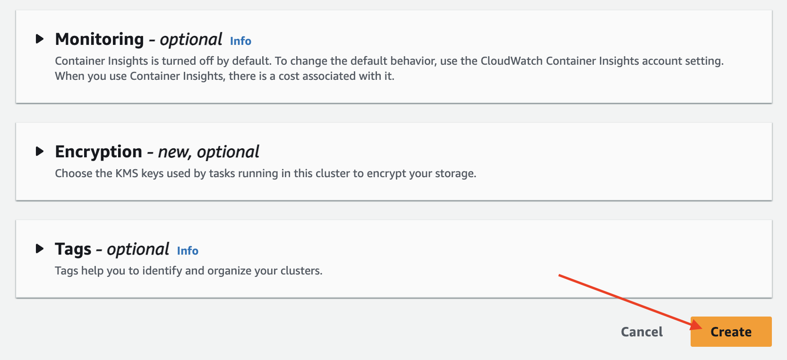
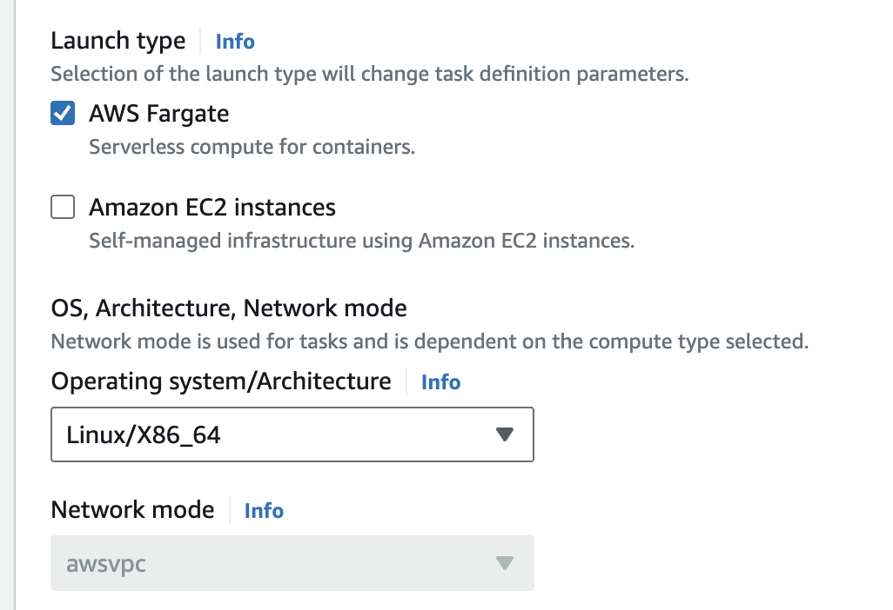
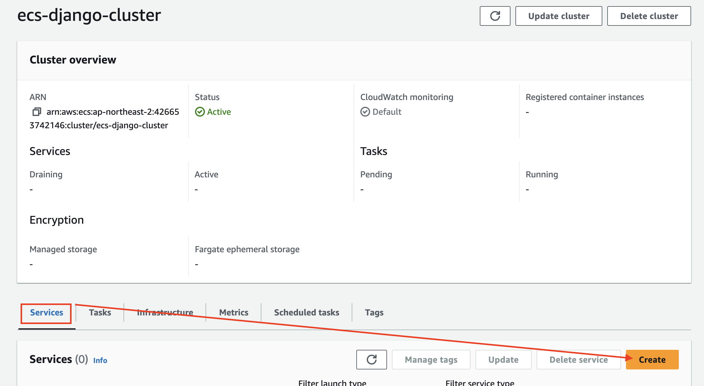
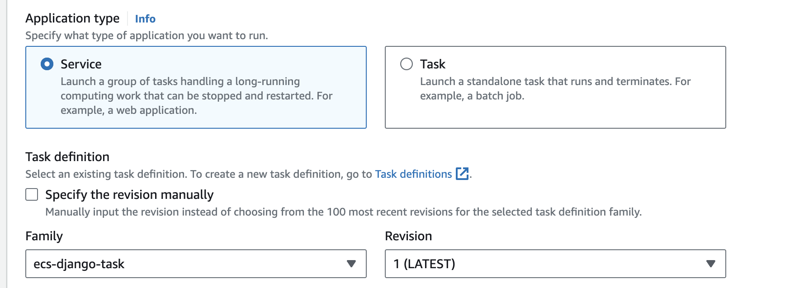
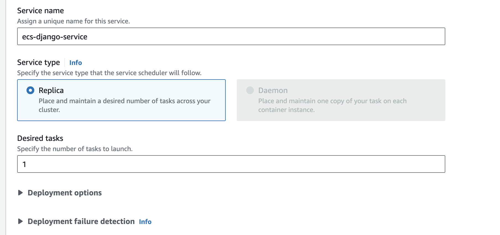
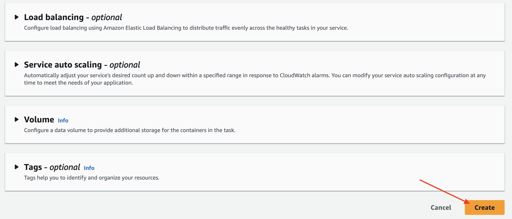
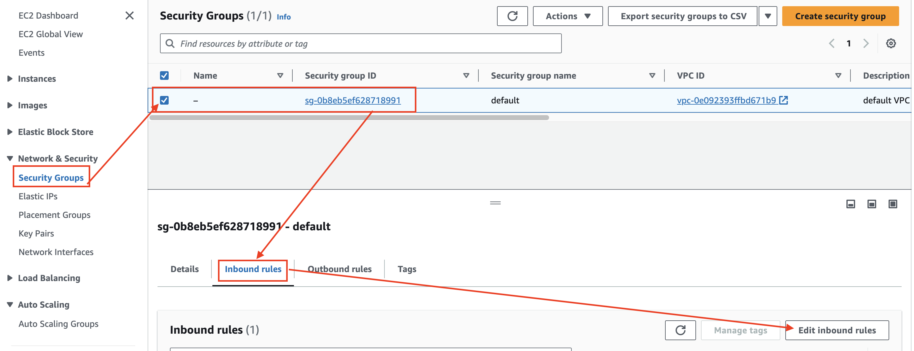
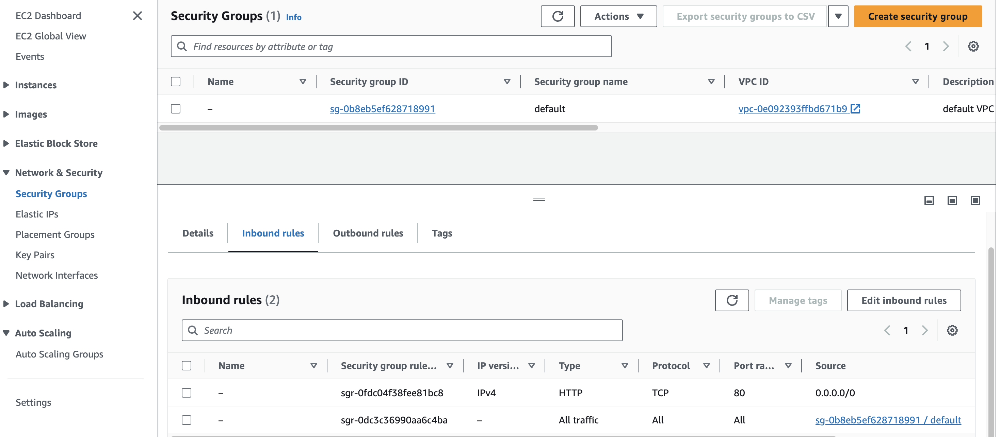
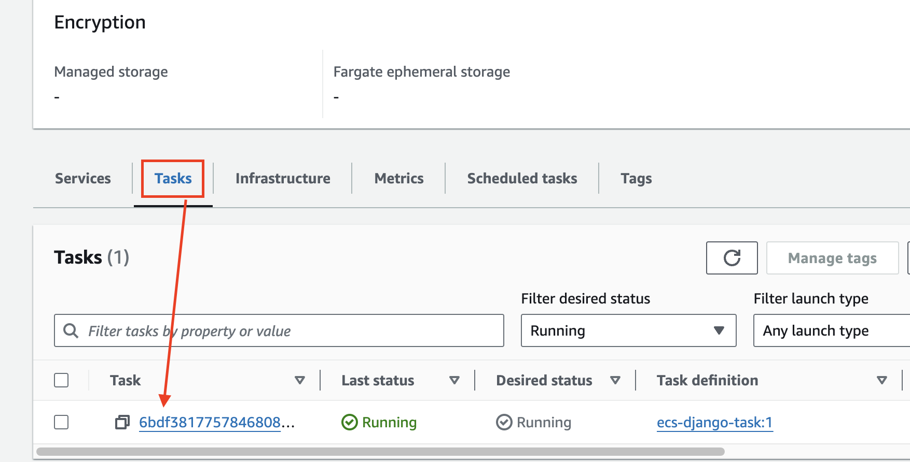
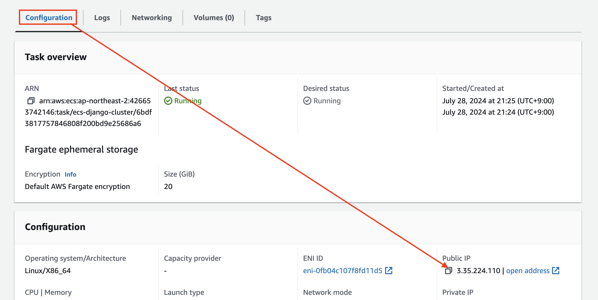

# [Amazon Elastic Container Service](https://aws.amazon.com/ko/ecs/)
- Amazon Elastic Container Service(ECS)는 컨테이너화된 애플리케이션이 더 효율적으로 배포하고 관리하고 규모를 조정하는 데 도움이 되는 완전관리형 컨테이너 오케스트레이션 서비스입니다. 


---
### 단계1: aws ecs 접속 


---
### 단계2: Create cluster


---
### 단계3: Create cluster > Cluster configuration


---
### 단계4: Create cluster > AWS Fargate


---
### 단계5: Create cluster > Create 클릭 


---
- 결과 확인 


---
### 단계6: Create task


---
### 단계7: Create task > Task definition configuration


---
### 단계8: Create task > Infrastructure requirements


---
### 단계9: Create task > Infrastructure requirements


---
### 단계10: AWS ECR > copy URI


---
### 단계11: Create task > Container
- Name: `buildspec.yml에 등록된 이름`
- Image URI: `aws ecr에 생성된 uri`


---
### 단계12: Create task > HealthCheck 


---
- HealthCheck
```shell
CMD-SHELL,curl -f http://localhost:80 || exit 1
```


---
### 단계13: Create task > Create


---
- 결과 확인 


---
### 단계14: aws ecs cluster 선택 


---
### 단계15: Create Service


---
### 단계16: Create Service > Environment


---
### 단계17: Create Service > Deployment configuration


---
- `Desired tasks`: 정의된 숫자만큼 instance(django server) 유지 



---
### 단계18: Create Service > Create


---


---
# Django service 접속 

---
### 단계1: aws ec2 > Security Groups


---


---
### 단계2: aws ecs > cluster


---
### 단계3: aws ecs > Task


---
### 단계4: aws ecs > Task > Public IP


---
### 단계5: 접속 성공 


