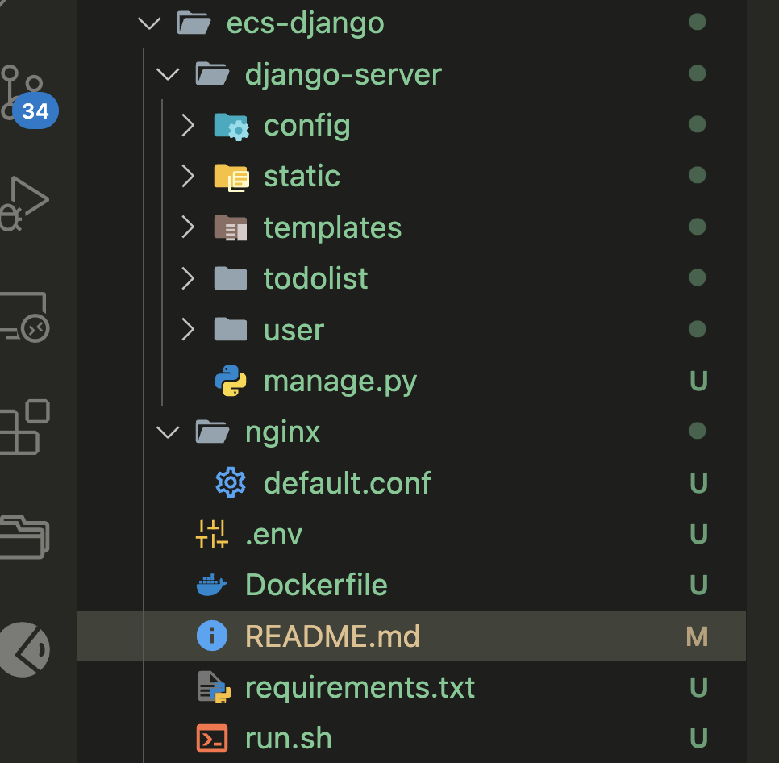
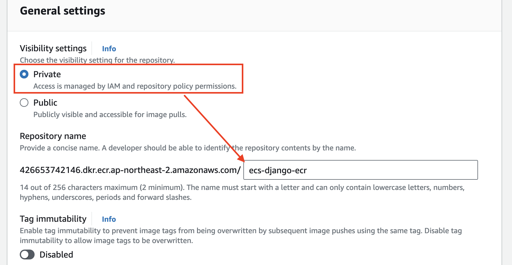
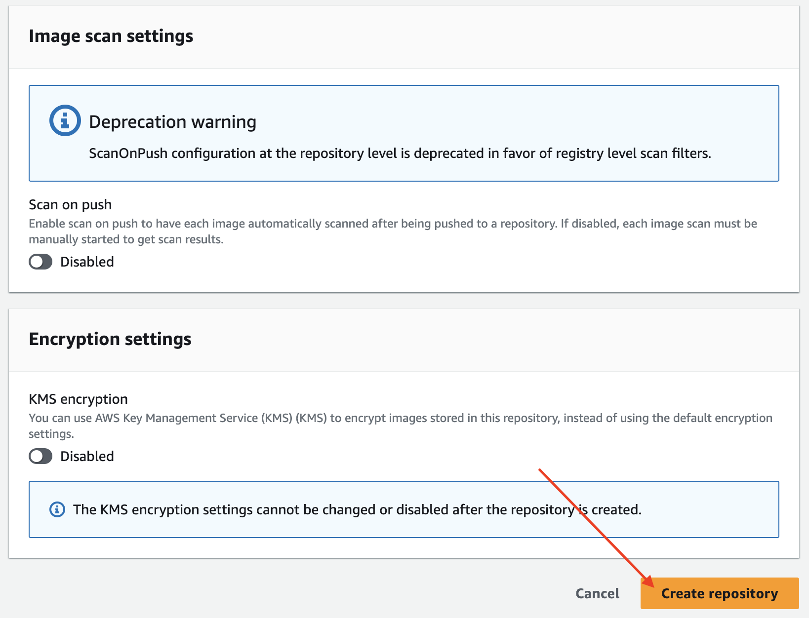
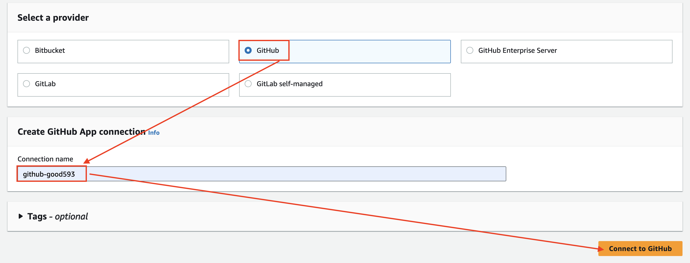
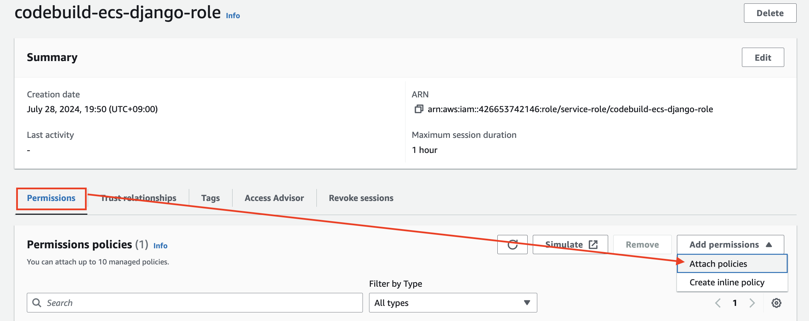
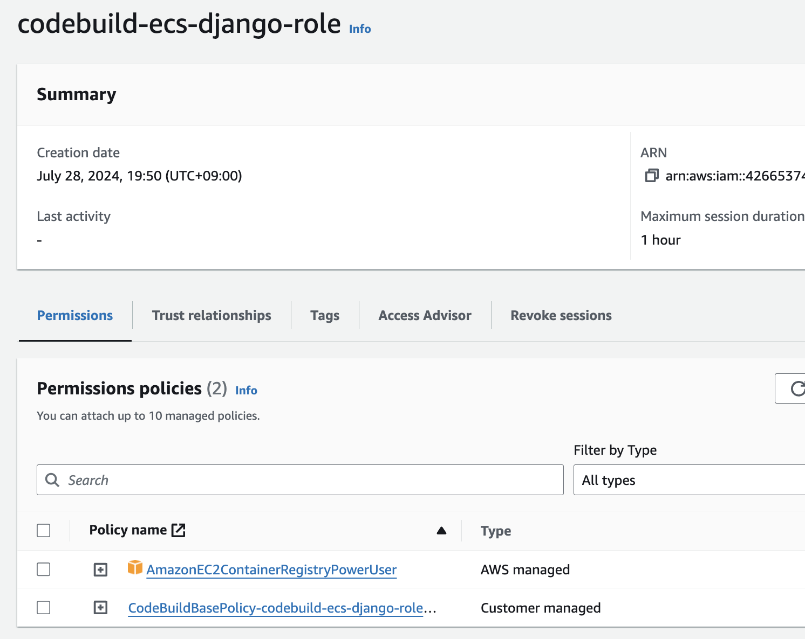

# Github

---
### 단계1: django with nginx
- 참고문서: `ec2/4-1. ec2 - django/1. django on docker.md`



---
### 단계2: Make docker image
- 명령어: `docker build --platform linux/amd64 -t [이미지명] .`
```shell
# Make docker image
docker build --platform linux/amd64 -t django-image .
```

### 단계3: Create container
- 명령어: `docker run --name [컨테이너명] -d -p 80:80  [이미지명]`
```shell
# Create container
docker run --name django-container -d -p 80:80 django-image
```

---
### 단계4: Django 접속 테스트
- `http://localhost:80/`


---
### 단계5: push to Github & 확인 


---
# [Amazon Elastic Container Registry](https://aws.amazon.com/ko/ecr/)
- Amazon Elastic Container Registry(Amazon ECR)는 어디서나 애플리케이션 이미지 및 아티팩트를 안정적으로 배포할 수 있도록 뛰어난 성능 호스팅을 제공하는 완전관리형 컨테이너 레지스트리입니다.


---
### 단계1: ECR 접속  


---
### 단계2: Create repository


---
### 단계3: Create repository > General settings


---
### 단계4: Create repository > 생성


---
### 단계5: 결과 확인  


---
# [AWS CodeBuild](https://aws.amazon.com/ko/codebuild/)
- AWS CodeBuild는 소스 코드를 컴파일하고 테스트를 실행한 다음 바로 배포 가능한 소프트웨어 패키지를 생성할 수 있는 완전관리형의 지속적 통합 서비스입니다.


---
### 단계1: buildspec.yml 생성


---
- 생성한 aws ecr 적용  
```yml
version: 0.2
env:
  git-credential-helper: yes
  variables:
    # docker 파라미터 정의
    ECS_CONTAINER_NAME: ecs-django-container
    IMAGE_REPO_NAME: ecs-django-ecr # aws ecr에 등록이 되어 있는 name
    IMAGE_TAG: latest
    AWS_DEFAULT_REGION: ap-northeast-2

...
```
---
- Github Repository에 있는 Dockerfile의 위치에 맞춰 수정
```yml
...

  build:
    commands:
      - echo Build started on `date`
      - echo Building the Docker image...
      # Github Repository에 있는 Dockerfile의 위치에 맞춰 수정 
      - docker build -f ./codepipeline/ecs-django/Dockerfile -t $IMAGE_REPO_NAME:$IMAGE_TAG .
      - docker tag $IMAGE_REPO_NAME:$IMAGE_TAG $REPOSITORY_URI

...
```
---
### 단계2: AWS CodePipeline


---
### 단계3: Create connection


---
### 단계4: Connect to GitHub


---
### 단계5: Connect


---
### 단계6: 결과 확인 


---
### 단계7: Create build project


---
### 단계8: Create build project > Project configuration


---
### 단계9: Create build project > Source


---
### 단계9: Create build project > Environment


---
### 단계10: Create build project > Buildspec
- Github에 저장된 buildspec.yml 위치 작성 


---
### 단계11: Create build project 클릭 


---
### 단계12: IAM 접속 


---
### 단계13: 생성한 codebuild role 선택 


---
### 단계14: Attach policies


---
### 단계15: add Permission
- codebuild에 ECR 접속 권한 추가 
```shell
AmazonEC2ContainerRegistryPowerUser
```


---
### 단계16: 결과 확인  


---
### 단계17: Start build


---


