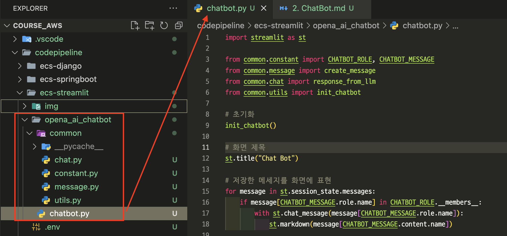
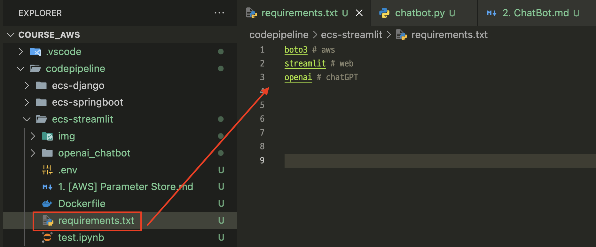

# ChatBot Project on streamlit


---
### 단계1: streamlit 실행 
```python
$ streamlit run chatbot.py
```


---
### 단계2: chatbot 실행 
```shell
Local URL: http://localhost:8501
```


---
# ChatBot Project on docker

---
### 단계1: [requirements.txt](https://www.freecodecamp.org/news/python-requirementstxt-explained/)
- 필요한 라이브러리 설정 



---
### 단계2: [streamlit on docker](https://docs.streamlit.io/deploy/tutorials/docker)


---
### 단계2: Make docker image
- 명령어: `docker build --platform linux/amd64 -t [이미지명] .`
```shell
# Make docker image
docker build --platform linux/amd64 -t streamlit-image .
```


---
- 생성된 이미지 확인 
```shell
docker images
```

---
### 단계3: Create container
- 명령어: `docker run --name [컨테이너명] -d -e [환경변수] -p 8501:8501  [이미지명]`
```shell
# Create container
docker run --name streamlit-container -d \
-e OPENAI_API_KEY=$(aws ssm get-parameters --region ap-northeast-2 --name "/TEST/CICD/STREAMLIT/OPENAI_API_KEY" --query "Parameters[0].Value" | tr -d '"') \
-p 8501:8501 streamlit-image
```

---


